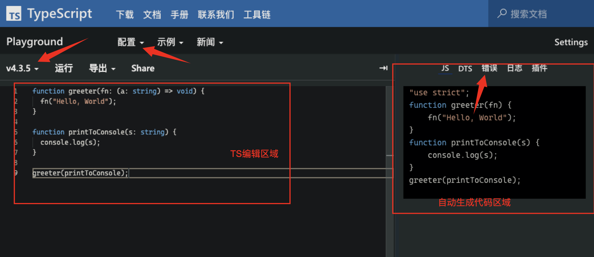

## 前言

之前一直使用的**Vue技术栈**，在一个大型无代码平台的业务项目中使用过**TypeScript**，当时感觉很不好用，之后一直不想在业务项目中使用TypeScript

直到最近创建了一个**React+TS**项目，才深刻体会到用**TypeScript**写业务代码真TMD爽，之前在Vue项目中完全没有体会到TS这么好用。

JavaScript代码只有在**运行时(runtime)**才能发现错误，言外之意把项目跑起来，查看浏览器中效果不对或者控制台报错了，才能发现错误。

TypeScript在你**写代码的过程中**就能发现错误，不用等到运行时。。

一顿牢骚过会，直奔主题，接下来我们讲解一下如何搭建一个学习TypeScript 开发环境

TypeScript中文官方地址：https://www.typescriptlang.org/zh/

## Playground

微软官方也提供了一个在线开发 TypeScript 的环境。学习和测试使用都很方便，对于刚接触TypeScript的新手来说，是个很好的选择，可以先把重点放到语法上，暂时不用关心TypeScript的编译和运行环境如何搭建。

地址：https://www.typescriptlang.org/zh/play




他还有一个好处，当使用在线开发 TypeScript 的环境写的代码遇到问题了，可直接把url给别人，他可以看到你的输入的代码，便于帮你查找问题。

例如：https://www.typescriptlang.org/zh/play?target=1&module=1&ts=3.9.7#code/GYVwdgxgLglg9mABAcwE4FN1XagFMMALkVwENiBnKVGMZASkQF4A+RANzhgBNGBvAFCJEBXACIAEugA20uABpEAdTipp3MfQDcAgL4CBoSLASIADjTBQAKnADCCCnGnpcFStVoNEg4REfO6AB0cshu2noGaJjYeBa0NvYBLtpAA 

打开上面的连接，你可以看到左侧编辑区域有输入的内容，内容和上面图片内容一致。

## TypeScript编辑环境

接下来讲解一下如何在项目中添加支持TypeScript的编辑环境。

#### 1.创建项目，并初始化package.json

```bash
# 创建文件夹
mkdir learn-ts 
# 进入文件夹
cd learn-ts
# 初始化项目
npm init -y
# 创建一个src文件夹，并在src文件夹下面添加index.ts
mkdir src
touch src/index.ts
```

#### 2.安装需要的依赖

```bash
npm install typescript --save-dev
```

之后执行 `tsc` 来运行 TypeScript 编译器。

```bash
npx tsc
```

看一下tsc 命令的用法：

**参数很多，我们只列举部分：**

```bash
语法:   tsc [options] [file...]
例子: tsc hello.ts
          tsc --outFile file.js file.ts
          tsc @args.txt
          tsc --build tsconfig.json

Options:
 -w, --watch   监听输入文件变化                                    
 --pretty      设置错误和消息的样式
 --all         展示所有的编译选项
 -v, --version 打印版本
 --init        创建 tsconfig.json  文件
 -b, --build 
 -d, --declaration  创建声明文件 .d.ts                                                        
 .....
 .....
 --allowJs        允许js文件参与编译  
```

#### 3.创建tsconfig.json文件

如果一个目录下存在一个`tsconfig.json`文件，那么它意味着这个目录是TypeScript项目的根目录。 `tsconfig.json`文件中指定了用来编译这个项目的根文件和编译选项。你可以通过**files**属性指定要编译的文件

运行命令，创建tsconfig.json文件和默认配置

```
npx tsc --init
```

执行完毕以上命令之后，会在根目录创建一个tsconfig.json文件。**文件里面有很多默认配置，下面我们展示一个示例文件**

详细的**编译选项**可以查看这个链接：https://www.typescriptlang.org/docs/handbook/compiler-options.html#compiler-options

`tsconfig.json`示例文件:

```json
{
    "compilerOptions": {
        "module": "system",
        "noImplicitAny": true,
        "removeComments": true,
        "preserveConstEnums": true,
        "outFile": "../../built/local/tsc.js",
        "sourceMap": true,
        "declaration": true, //创建声明文件
    },
    "files": [
        "core.ts",
        "sys.ts"
    ]
}
```

#### 4.使用`"include"`和`"exclude"`属性

node_module不需要编译，只需要编译src文件夹里面的内容，所以我们要修改tsconfig.json文件

```json
{
    "compilerOptions": {
        "module": "system",
        "noImplicitAny": true,
        "removeComments": true,
        "preserveConstEnums": true,
        "outFile": "../../built/local/tsc.js",
        "sourceMap": true,
        "declaration": true, //创建声明文件
        "declarationMap": true,
        "inlineSourceMap": true,
        "inlineSources": true,
    },
    "include": [
        "src/**/*"
    ],
    "exclude": [
        "node_modules",
        "**/*.spec.ts"
    ]
}
```

- include:参与编译的文件
- exclude：排除文件

#### 5.细节说明

`"compilerOptions"`可以被忽略，这时编译器会使用默认值。在这里查看完整的[编译器选项](https://www.tslang.cn/docs/handbook/compiler-options.html)列表。

 `"include"`和`"exclude"`属性指定一个文件glob匹配模式列表。 支持的glob通配符有：

- `*` 匹配0或多个字符（不包括目录分隔符）
- `?` 匹配一个任意字符（不包括目录分隔符）
- `**/` 递归匹配任意子目录

如果一个glob模式里的某部分只包含`*`或`.*`，那么仅有支持的文件扩展名类型被包含在内（比如默认`.ts`，`.tsx`，和`.d.ts`， 如果 `allowJs`设置能`true`还包含`.js`和`.jsx`）。

如果`"files"`和`"include"`都没有被指定，编译器默认包含当前目录和子目录下所有的TypeScript文件（`.ts`, `.d.ts` 和 `.tsx`），排除在`"exclude"`里指定的文件。JS文件（`.js`和`.jsx`）也被包含进来如果`allowJs`被设置成`true`。 如果指定了 `"files"`或`"include"`，编译器会将它们结合一并包含进来。 使用 `"outDir"`指定的目录下的文件永远会被编译器排除，除非你明确地使用`"files"`将其包含进来（这时就算用`exclude`指定也没用）。

### 

### 使用命令行界面

```bash
# 根据项目根目录下面的 tsconfig.json编译ts文件
tsc
# 指定要编译的特定文件，例如下面例子：只会编译index.ts文件
tsc index.ts
# 编译src下面所有的.ts文件
tsc src/*.ts
# 指定tsconfig.json
tsc --project tsconfig.production.json
# 生成.d.ts文件 和index.js文件
tsc index.js --declaration --emitDeclarationOnly
# 将 app.ts 和util.ts内容编译合并到index.js文件中
tsc app.ts util.ts --target esnext --outfile index.js
# tsc 设定一个 watch 参数监听文件内容变更，实时进行类型检测和代码转译
tsc index.ts --strict --alwaysStrict false --watch
```

### 实例演示

在src/index.ts里面添加如下内容

```typescript
interface LabeledValue {
  label: string;
}

function printLabel(labeledObj: LabeledValue) {
  console.log(labeledObj.label);
}

let myObj = {label: "Size 10 Object" };
printLabel(myObj);
```

在项目跟目录下面，运行编译命令，会根据跟目录的tsconfig.json编译

```bash
npx  tsc
```

结果：

```javascript
"use strict";
function printLabel(labeledObj) {
    console.log(labeledObj.label);
}
var myObj = { label: "Size 10 Object" };
printLabel(myObj);

```

也可以在package.json添加scripts方式 一直监听

```json
"scripts": {
    "version": "tsc -v",
    "dev": " tsc --build tsconfig.json --watch"
}
```


### 添加ts-node

上面代码实例演示了通过tsc命令对TypeScript文件进行了编译，但是如果想编译完了，直接运行怎么办呢？

这时候就会用到ts-node。你可以近似地认为 ts-node = tsc + node

- tsc 是一个编译器，把 TS 变成 JS。

- ts-node 是一个执行环境，把 TS 变成 JS 然后执行。

#### 安装ts-node

```javascript
npm i ts-node  -D
npm i @types/node -D
```

#### 用法

```bash
# Execute a script as `node` + `tsc`.
ts-node src/index.ts

# Starts a TypeScript REPL.
ts-node

# Execute code with TypeScript.
ts-node -e 'console.log("Hello, world!")'

# Execute, and print, code with TypeScript.
ts-node -p -e '"Hello, world!"'

# Pipe scripts to execute with TypeScript.
echo 'console.log("Hello, world!")' | ts-node

# Equivalent to ts-node --transpile-only
ts-node-transpile-only script.ts

# Equivalent to ts-node --cwd-mode
ts-node-cwd script.ts

```

#### 其他

想要了解更多ts-node用法，可以查看官方文档：https://typestrong.org/ts-node/

